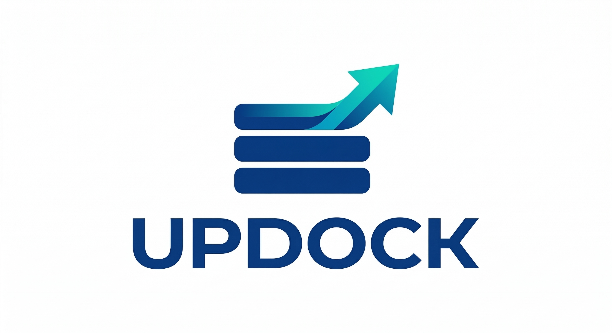

<p align="center">
  
</p>

<h1 align="center">Updock</h1>

<p align="center">
  <a href="https://github.com/huseyinbabal/updock/actions/workflows/ci.yml"></a>
</p>

<p align="center">Declarative container update platform with policy engine, audit trail, and web dashboard.</p>

## Quick Start

```yaml
# docker-compose.yml
services:
  updock:
    image: ghcr.io/huseyinbabal/updock:latest
    volumes:
      - /var/run/docker.sock:/var/run/docker.sock
      - ./updock.yml:/etc/updock/updock.yml
    ports:
      - "8080:8080"
```

```yaml
# updock.yml
policies:
  default:
    strategy: patch
    approve: auto
    rollback: on-failure

containers:
  postgres:
    policy: locked
    schedule: "02:00-04:00"

groups:
  web-stack:
    members: [redis, app, nginx]
    strategy: rolling
    order: [redis, app, nginx]
```

Open `http://localhost:8080` for the dashboard.

## Documentation

Full docs at [huseyinbabal.github.io/updock](https://huseyinbabal.github.io/updock)

## License

Apache-2.0
